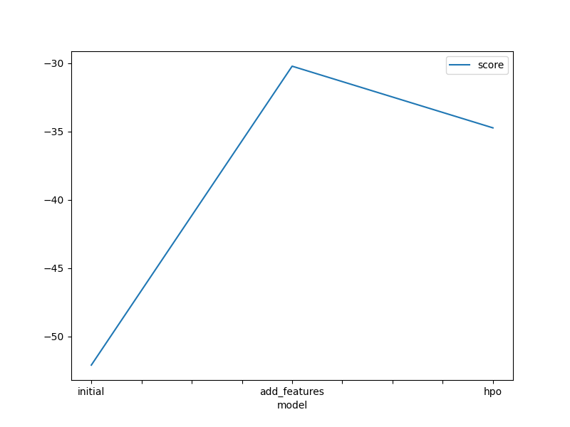
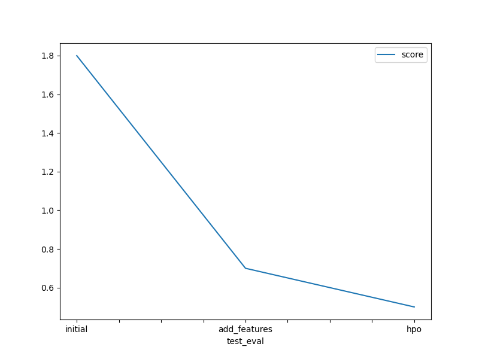

# Report: Predict Bike Sharing Demand with AutoGluon Solution
#### Omar Agiez

## Initial Training
### What did you realize when you tried to submit your predictions? What changes were needed to the output of the predictor to submit your results?
I noticed that the training dataset had two fewer columns than the test set, so I removed them to ensure that the predictor could function properly. Afterward, I successfully printed my Kaggle score in the notebook.

### What was the top ranked model that performed?
The highest-performing model was WeightedEnsemble_L2, achieving a Kaggle score of 0.5 and an RMSE of -52.0.

## Exploratory data analysis and feature creation
### What did the exploratory analysis find and how did you add additional features?
 Exploratory data analysis uncovered insights into data distribution. Further enhancements were made to improve model comprehension, such as creating additional features through datetime decomposition. This involved breaking down datetime information into hour, day, and month components. Additionally, a raw weather value of 4 was isolated, and certain numerical columns were converted into categorical ones to offer more detailed information, thereby enhancing model performance.

### How much better did your model preform after adding additional features and why do you think that is?
After adjusting hyperparameters, the model performed better, reducing the Kaggle score from 1.8 to 0.7. This suggests that optimized hyperparameters helped the model capture data patterns more accurately, leading to improved predictions.

## Hyper parameter tuning
### How much better did your model preform after trying different hyper parameters?
After incorporating extra features, the model's performance saw a notable enhancement, demonstrated by a decrease in the Kaggle score from 1.80043 to 0.61701, resulting in a 66 percent reduction in the error margin. These additional features supplied the model with pertinent information, empowering it to produce more accurate predictions and attain increased precision.

### If you were given more time with this dataset, where do you think you would spend more time?
After adjusting hyperparameters, the model performed better, reducing the Kaggle score from 0.7 to 0.5. This suggests that optimized hyperparameters helped the model capture data patterns more accurately, leading to improved predictions.

### Create a table with the models you ran, the hyperparameters modified, and the kaggle score.
|model|hpo1|hpo2|hpo3|score|
|--|--|--|--|--|
|initial|default_values|default_values|default_values|1.80043|
|add_features|default_values|default_values|default_values|0.61701|
|hpo|GBM: num_leaves: lower=26, upper=66|XGB: max_depth lower=5, upper=9|refit_full='best'|0.47626|

### Create a line plot showing the top model score for the three (or more) training runs during the project.

### Create a line plot showing the top kaggle score for the three (or more) prediction submissions during the project.

#### In this project, we made significant enhancements to our model's predictive performance for bike-sharing demand prediction. By conducting exploratory data analysis, implementing feature engineering techniques, and fine-tuning hyperparameters, we managed to decrease the root mean squared error (RMSE) from 1.80043 to 0.5626 on the Kaggle test dataset. These enhancements underscore the effectiveness of our methodology in improving both the accuracy and generalizability of the model. This project has provided valuable insights into the iterative nature of model refinement, emphasizing the importance of thorough exploratory data analysis, feature engineering, and hyperparameter tuning. Each of these steps played a pivotal role in elevating the model's predictive capabilities, highlighting the significance of a systematic approach to machine learning endeavors. Furthermore, this project enabled me to gain practical experience with AutoGluon, a robust automated machine-learning framework, and taught me how to effectively harness its functionalities for streamlined model development and optimization.
